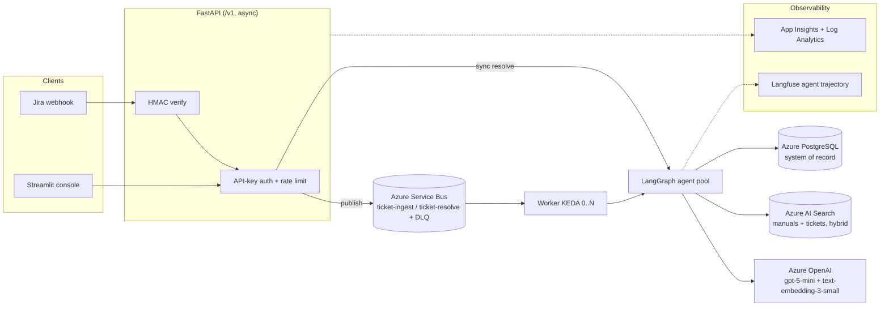
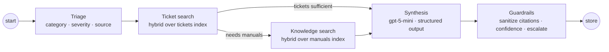

# Agentic Technical (Jira) Support Copilot

**A production style agentic AI system that resolves Siemens industrial automation support tickets against a real 500 page technical manual, in about 30 secs.**

Instead of manually searching hundreds of pages, the system:

1. **Understands** the support ticket using a Triage Agent.
2. **Retrieves** relevant manual sections using hybrid keyword and semantic search.
3. **Generates** a step by step resolution grounded in the retrieved evidence.
4. **Cites** the exact manual pages supporting the answer.
5. **Validates** grounding and confidence before returning the result.
6. **Escalates** uncertain cases to a human instead of guessing.
7. **Stores and serves** the resolution through an API and support console.

## Why it matters

Real Siemens documentation → hybrid retrieval → multi agent reasoning → cited
answer → citation validation → human escalation → production API

Here every step resolves to a page an engineer can open, the system refuses
when the manual cannot answer, and quality is enforced as a CI build gate rather
than asserted in a README.

## Key results

Eleven case golden set, gated in CI:

| Metric | Result |
|---|---|
| Retrieval recall@k | 0.94 |
| Answer faithfulness | 0.94 |
| Fabricated citations | 0.00 |
| Escalation accuracy | 1.00 |
| Cost per resolution | ~€0.006 |

**Production engineering:** Azure Container Apps, Terraform, LangGraph, Azure AI
Search, Azure OpenAI, PostgreSQL, Service Bus, CI/CD with an evaluation gate,
Langfuse and Application Insights observability, Presidio PII masking and GDPR
right to erasure.

<p>


</p>

- **Domain:** Siemens SIMATIC S7-1500 / ET 200MP industrial automation.
- **Pattern:** the same architecture class as the *Siemens Industrial Copilot*. Implemented end-to-end at portfolio scale.

---

## Table of contents

- [What it does](#what-it-does)
- [Live demo](#live-demo)
- [Tech stack](#tech-stack)
- [System architecture](#system-architecture)
- [The agent workflow](#the-agent-workflow)
- [Retrieval strategy](#retrieval-strategy)
- [Evaluation strategy](#evaluation-strategy)
- [Reliability & guardrails](#reliability--guardrails)
- [Security & GDPR](#security--gdpr)
- [Observability](#observability)
- [Infrastructure & DevOps](#infrastructure--devops)
- [Run it locally](#run-it-locally)
- [Run it on Azure](#run-it-on-azure)
- [Repository structure](#repository-structure)
- [Engineering standards](#engineering-standards)
- [Key architecture decisions](#key-architecture-decisions)
- [Roadmap](#roadmap)

---

## What it does

1. A support ticket arrives (live Jira webhook, or the internal console).
2. A **Triage** agent classifies category, severity, and which knowledge source to use.
3. Retrieval pulls **similar past tickets** and **relevant manual sections** via hybrid search.
4. A **Synthesis** agent drafts a step-by-step resolution, each step **cited to a specific manual page**.
5. A **Guardrails** layer verifies every citation is real, scores confidence, and **escalates to a human** when grounding or confidence is low.
6. The result: steps, citations, confidence, and per-resolution **EUR cost**, is stored and served through a versioned API and a Streamlit ops console.

---

## Live demo

> 🎥 **Demo video:** *add link here*
> 🌐 **Live deployment:** Azure Container Apps (Sweden Central, EU). The environment is provisioned on demand and paused to control cost.

The internal console: a Jira-style ticket queue, live KPIs, and one-click AI resolution with clickable citations and an escalation banner.

<!-- add: assets/dashboard.png -->

---

## Tech stack

| Layer | Technology |
|---|---|
| **Language / runtime** | Python 3.12, async FastAPI, Pydantic v2, mypy `--strict` |
| **Agents** | LangGraph (typed state machine), structured outputs, versioned prompts |
| **LLM** | Azure OpenAI `gpt-5-mini` + `text-embedding-3-small`; provider-agnostic layer (Azure OpenAI / Azure AI Foundry / Anthropic / Ollama) |
| **Retrieval** | Azure AI Search — hybrid BM25 + vector (HNSW) + semantic ranking |
| **System of record** | Azure Database for PostgreSQL (Flexible Server); SQLAlchemy 2.0 + Alembic migrations |
| **Messaging** | Azure Service Bus (queues + native DLQ), KEDA queue-length autoscaling |
| **PII / privacy** | Microsoft Presidio (spaCy `en_core_web_md`) |
| **Evaluation** | Golden dataset, deterministic retrieval metrics, LLM-as-judge, MLflow tracking, CI eval gate |
| **Observability** | Langfuse (EU) agent tracing, Application Insights + Log Analytics, structured JSON logs w/ correlation IDs |
| **Infrastructure** | Terraform (`azurerm`), Azure Container Apps, ACR, Key Vault, user-assigned Managed Identity |
| **CI/CD** | GitHub Actions (CI, eval gate, OIDC deploy), `production` environment, revision rollback |
| **Packaging** | Multi-stage Dockerfile (api / worker / ingest / ui), non-root; `docker compose` local stack |
| **UI** | Streamlit internal support console |

---

## Repository structure

```bash
src/copilot/
├── api/          FastAPI app, routers, middleware, RFC 7807 handlers
├── agents/       LangGraph graph, nodes, typed CopilotState
├── ingestion/    chunking · Presidio masking · embedding · index upsert · pipeline
├── retrieval/    AI Search hybrid client + index definitions
├── llm/          provider-agnostic layer + the wrapper (retries, breaker, budget, cost)
├── messaging/    Service Bus publisher/consumer, idempotency
├── security/     hashed API keys, rate limiting, HMAC
├── evaluation/   golden dataset runner, metrics, LLM judge, MLflow
├── telemetry/    Langfuse integration
├── db/           SQLAlchemy models, Alembic migrations
├── gdpr.py       right-to-be-forgotten deletion saga
└── worker.py     async Service Bus worker
ui/               Streamlit console
prompts/          versioned prompt artifacts (YAML front-matter)
eval/             golden dataset, thresholds, recorded results
infra/            Terraform (platform + container apps)
docker/           multi-stage Dockerfile (4 targets)
.github/workflows ci.yml · eval.yml · cd.yml
tests/            unit + failure-path + API tests (82)
```

---

## System architecture

Two request paths share one agent core. The **synchronous** path (console/demo) runs the graph in-request; the **asynchronous** path (production) decouples ingestion and resolution through a durable queue with dead-lettering.



**Design principle : truth vs. derived data:** PostgreSQL is the durable **system of record**; Azure AI Search is **derived, rebuildable** retrieval state. The index can be reconstructed from the source manuals and the document registry at any time.

---

## The agent workflow

A typed `CopilotState` (Pydantic) flows through a **LangGraph** state machine. The knowledge-retrieval step is a **conditional edge**, skipped when triage judges historical tickets sufficient.



- **Structured outputs** — every LLM response is Pydantic-validated. Invalid output triggers one corrective re-prompt, then a **degraded, escalated** result.
- **Versioned prompts** — prompts are YAML artifacts (`id`, `version`, `changelog`); the version is logged with every call, so any answer is traceable to the exact prompt that produced it.
- **Single LLM choke point** — every model call goes through one wrapper adding timeouts, exponential backoff + jitter retries, a per-process **circuit breaker**, a per-request **cost budget**, and **EUR cost accounting**.

---

## Retrieval strategy

Retrieval quality is the core of the product, so it uses **one managed service instead of hand-rolled components**.

- **Hybrid search:** every query runs **BM25 keyword** + **vector KNN (HNSW)** in a single request, fused server-side with **Reciprocal Rank Fusion**, then **semantic re-ranking**. Keyword search nails exact tokens (error codes like `0x2521`, part numbers); vectors catch paraphrases ("CPU won't start" ≈ "startup inhibit").
- **Two indexes:** `manuals` (chunk-level, page citations) and `tickets` (with resolution text). Triage labels become **server-side filters**.
- **Typed results:** retrieval returns typed hits carrying `(doc, page)` citation metadata, which the guardrails layer later validates against, making "fabricated-citation rate = 0" a *testable invariant*.

---

## Evaluation strategy

Quality is measured and regressions are blocked in CI. Every prompt/agent/retrieval change re-runs the golden dataset. A metric below its floor fails the build.

| Metric | What it verifies | Result | Gate floor |
|---|---|---:|---:|
| **retrieval recall@k** | Did we find the pages that actually answer the ticket? | **0.94** | 0.60 |
| retrieval precision@k | How much retrieved context was relevant? | 0.55 | 0.30 |
| **fabricated-citation rate** | Every citation points to a really-retrieved page | **0.00** | 0.0 max |
| **faithfulness** (LLM judge) | Every claim is supported by the retrieved context | **0.95** | 0.70 |
| answer relevancy (LLM judge) | The answer addresses the ticket | 0.95 | 0.70 |
| **escalation accuracy** | Escalates exactly the tickets the manual can't answer | **0.91** | 0.80 |
| mean confidence (covered) | Calibration on answerable tickets | 0.89 | 0.60 |

- **Two scoring families:** Deterministic metrics (retrieval precision/recall with page tolerance, fabricated-citation rate, escalation correctness) + an **LLM-as-judge** for faithfulness and answer relevancy, reusing the cost-tracked LLM wrapper.
- **Experiment tracking in MLflow**; Per-trace online scores in Langfuse, clear separation of offline vs. online.
- **The gate earned its keep:** Guardrails **sanitize** ungrounded citations, driving fabrication to 0 *by construction*.

Run it: `make eval` (full) or `make eval-fast` (deterministic only).

---

## Reliability & guardrails

Every failure is **retried, degraded, escalated, or dead-lettered, never silently swallowed.**

- **Typed exception taxonomy** → Each maps to one RFC 7807 `problem+json` response with a correlation ID; clients never see a stack trace.
- **Transient faults:** backoff+jitter retries + per-dependency circuit breaker (open → 503 + `Retry-After`).
- **Bad LLM output:** one corrective re-prompt, then a degraded escalation.
- **Poison messages:** Service Bus redelivery → **dead-letter after 5 attempts** (verified with a poison-message drill).
- **Grounding:** guardrails drop any citation not in the retrieved context, so the delivered answer's fabricated-citation rate is **0 by construction**.
- **Every failure path has an explicit test** (429 storms, poison messages, malformed generations, mid-saga faults).

---

## Security & GDPR

Built for the EU / German market, data residency and erasure are first-class.

- **Managed Identity everywhere** — Apps authenticate to ACR, Key Vault, Service Bus, and Storage passwordlessly; **zero secrets in code or images**. Local dev uses `DefaultAzureCredential`.
- **Secrets in Key Vault**, read by reference through the managed identity. Deployer and app get least-privilege roles.
- **API security:** hashed API keys (SHA-256 + pepper, never plaintext), per-key rate limiting, HMAC-verified webhooks (constant-time compare), security headers, request-size limits.
- **PII masking (Presidio)** before any storage, indexing, or logging, A Vector is an irreversible projection of its text, so masking runs at the pipeline entrance.
- **GDPR right-to-be-forgotten:** `DELETE /v1/tickets/{id}` runs a **verified deletion saga** across Azure AI Search + PostgreSQL, scrubs job payloads, and writes an audit-log entry. Verified live: create → masked store → erase → `404`.
- **EU data residency:** all resources in Sweden Central; Langfuse EU region. A documented data-flow map records where personal data can appear in each store, and the honest limits (backups may retain erased rows until they age out).

---

## Observability

Three concerns, three tools, one correlation ID that ties a request together.

| Question | Tool |
|---|---|
| Why did the agent produce *this* answer, at what cost? | **Langfuse** (agent trajectory, EU) |
| Is the service up / fast / erroring? What happened in this request? | **Application Insights + Log Analytics** (auto from Container Apps + structured JSON logs) |

MLflow is offline evaluation tooling and is not deployed: `make eval` logs prompt
versions and golden-set metrics locally, viewable with `mlflow ui`.

Container logs, useful when a request fails:

```bash
az containerapp logs show -n copilot-dev-api -g $RG --tail 100
```

Updating a secret after deployment:

```bash
az containerapp update -n copilot-dev-api -g $RG --revision-suffix <new>
terraform apply -var deploy_apps=true
```

---

## Infrastructure & DevOps

- **Terraform (`azurerm`)** provisions the whole platform — resource group, ACR, Key Vault, Managed Identity + RBAC, PostgreSQL, AI Search, Service Bus, Container Apps environment, Log Analytics + App Insights. `plan → apply → destroy → apply` reproduces cleanly; teardown is the cost-control strategy.
- **Azure Container Apps** (not AKS — an explicit ADR): KEDA autoscaling (worker **0→N** on queue length, API on HTTP concurrency), revisions with traffic split for safe rollout/rollback, Managed Identity, ingress + TLS.
- **CI/CD (GitHub Actions):**
  - `ci.yml` — ruff, mypy strict, pytest, Docker builds (api/worker/ui), Terraform fmt + validate.
  - `eval.yml` — the golden-dataset eval gate on PRs touching prompts/agents/retrieval.
  - `cd.yml` — on merge to main: build+push images by SHA → roll each app → smoke test → **roll back on failure**, authenticated by **OIDC** (no stored cloud secret) and gated by a GitHub **production environment**.
- **Cost-engineered:** ~€19/mo while running (Postgres + ACR dominate; Container Apps scale to zero), torn down or paused when idle. A resolution costs ~€0.006.

---

## Run it locally

**Prerequisites:** Docker, Python 3.12, Azure CLI (`az login`), an Azure OpenAI resource with `gpt-5-mini` + `text-embedding-3-small` deployments, and an Azure AI Search service.

### 1. Setup

```bash
python3.12 -m venv .venv && source .venv/bin/activate
make install                      # deps + spaCy en_core_web_md
cp .env.example .env
```

Fill in `.env`:

| Variable | Where to find it |
|---|---|
| `AZURE_OPENAI_ENDPOINT` / `AZURE_OPENAI_API_KEY` | Azure portal → your OpenAI resource → Keys and Endpoint |
| `AZURE_SEARCH_ENDPOINT` / `AZURE_SEARCH_API_KEY` | Azure portal → your Search service → Settings → Keys |
| `API_KEY` and `COPILOT_API_KEY` | Any value you choose — **must be identical**. The API validates the first; the Streamlit console sends the second. |

Leave `DATABASE_URL` pointing at `localhost` : commands run on the host need it.
Compose overrides it to the `db` service hostname for containers automatically.

```bash
make check-azure                  # fail fast: verifies both deployments respond
```

Do not continue until this passes — everything downstream depends on it.

### 2. Build the knowledge base (one-time, ~€0.005)

```bash
make search-indexes               # create the manuals + tickets indexes
docker compose up -d db           # start Postgres
make migrate                      # create the tables (required before ingest)
make ingest                       # PDF → chunks → PII mask → embed → index
```

`make ingest` writes to the `document_registry` table, so migrations must run
first. Re-running it is a no-op: unchanged documents are skipped by content hash.

### 3. Verify the agent without the web layer

```bash
make resolve title="CPU STOP after firmware update" \
             desc="After updating firmware the CPU enters STOP with the SF LED on"
```

Runs triage → retrieval → synthesis → guardrails and prints the cited answer,
confidence, and EUR cost. An out-of-scope ticket is escalated.

### 4. Run the full stack

```bash
make up                           # Postgres + migrations + API + UI (first build ~8 min)
```

In a second terminal:

```bash
curl -s -X POST localhost:8000/v1/tickets/seed -H "X-API-Key: $API_KEY"
open http://localhost:8501        # the console
open http://localhost:8000/docs   # interactive OpenAPI
```

Use `localhost`, not `0.0.0.0` — the latter is a bind address, not a destination.

### 5. Quality gates

```bash
make lint      # ruff + mypy strict
make test      # 82 tests, hermetic
make eval      # golden-dataset eval gate (calls Azure, costs money)
make eval-fast # deterministic metrics only, no LLM judge

mlflow ui --port 5000
open http://127.0.0.1:5000  # eval run history: metrics per prompt version
open https://cloud.langfuse.com   # per-request agent traces: node timings, tokens, cost
```

### Notes

- **The async path needs Azure.** `make up-async` starts the worker, but it
  consumes from Azure Service Bus, which has no local emulator here. Locally you
  get Postgres, the API, the UI, and the synchronous path.
- **Reset everything:** `docker compose down -v` — the `-v` deletes the Postgres
  volume. Without it, data survives restarts.
- **After changing `.env`:** run `make down && make up`. Compose reads the file at
  startup, so a restart is required.

### Troubleshooting

| Symptom | Cause |
|---|---|
| `relation "document_registry" does not exist` | `make migrate` not run before `make ingest` |
| Console shows a `TypeError` or an empty queue | `API_KEY` and `COPILOT_API_KEY` differ; check with `docker compose config` |
| `connection refused` on port 5432 | `DATABASE_URL` uses `db` instead of `localhost` for a host-run command |
| `make check-azure` fails | Wrong endpoint, key, or deployment name — nothing downstream will work |

---

## Run it on Azure

The deploy is fully scripted; `cd.yml` performs these same steps automatically on merge to main.

Terraform provisions everything except Azure OpenAI, which must already exist with
`gpt-5-mini` and `text-embedding-3-small` deployed. Everything below runs from a
shell where you've already done `az login`.

### 1. Provision the platform

```bash
cd infra

export TF_VAR_subscription_id=$(az account show --query id -o tsv)
export TF_VAR_postgres_admin_password='<choose-a-strong-password>'
export TF_VAR_azure_openai_endpoint='https://<your-openai>.cognitiveservices.azure.com'

terraform init
terraform plan          # review what will be created and what it costs
terraform apply
```

This creates the resource group, container registry, Key Vault, managed identity,
PostgreSQL, AI Search, Service Bus, Container Apps environment, and Log Analytics & Application Insights.

Keep the three `TF_VAR_` exports set for every later `terraform` command in this
shell. Terraform re-reads them on each run.

### 2. Build and push the three images

```bash
export RG=$(terraform output -raw resource_group)
export ACR=$(terraform output -raw acr_login_server | cut -d. -f1)

cd ..
az acr build -r $ACR -t copilot-api:latest    -f docker/Dockerfile --target api    .
az acr build -r $ACR -t copilot-worker:latest -f docker/Dockerfile --target worker .
az acr build -r $ACR -t copilot-ui:latest     -f docker/Dockerfile --target ui     .
cd infra
```

`az acr build` builds in the cloud, so no local Docker daemon is needed. The
registry has the admin user disabled, the apps pull via managed identity.

### 3. Load the six secrets into Key Vault

```bash
export KV=$(terraform output -raw key_vault_uri | cut -d/ -f3 | cut -d. -f1)
export PG=$(terraform output -raw postgres_fqdn)
export SEARCH=$(terraform output -raw search_endpoint | cut -d/ -f3 | cut -d. -f1)

# the AI Search service is new
export SEARCH_KEY=$(az search admin-key show --service-name $SEARCH -g $RG --query primaryKey -o tsv)

az keyvault secret set --vault-name $KV -n database-url \
  --value "postgresql+psycopg://copilotadmin:${TF_VAR_postgres_admin_password}@${PG}:5432/jira_copilot?sslmode=require"
az keyvault secret set --vault-name $KV -n azure-openai-key    --value '<your Azure OpenAI key>'
az keyvault secret set --vault-name $KV -n azure-search-key    --value "$SEARCH_KEY"
az keyvault secret set --vault-name $KV -n api-key             --value "$(openssl rand -hex 24)"
az keyvault secret set --vault-name $KV -n api-key-pepper      --value "$(openssl rand -hex 32)"
az keyvault secret set --vault-name $KV -n jira-webhook-secret --value "$(openssl rand -hex 32)"
```

| Secret | What it is |
|---|---|
| `database-url` | connection string to the PostgreSQL server Terraform just created |
| `azure-openai-key` | key of your existing Azure OpenAI resource |
| `azure-search-key` | admin key of the AI Search service Terraform just created |
| `api-key` | the key this API requires in the `X-API-Key` header |
| `api-key-pepper` | second secret used to hash API keys before storage |
| `jira-webhook-secret` | shared secret Jira signs its webhook payloads with |
| `langfuse-public-key` / `langfuse-secret-key` | agent tracing; must be a matched pair from one Langfuse project |

A  `servicebus-connection` secret, is created by Terraform automatically,
KEDA needs it to read queue depth for autoscaling. You don't set it.

### 4. Create the container apps

```bash
terraform apply -var deploy_apps=true
```

Creates the API, worker, UI, and the migration job. All four authenticate to ACR,
Key Vault, and Service Bus through the user-assigned managed identity, no
passwords in any image or environment variable.

### 5. Migrate the cloud database

```bash
az containerapp job start --name copilot-dev-migrate --resource-group $RG

# confirm it worked before continuing
az containerapp job execution list --name copilot-dev-migrate --resource-group $RG \
  --query "[0].properties.status" -o tsv        # expect: Succeeded
```

### 6. Populate the search index

Terraform creates the AI Search service **empty**. Without this step the deployed
app returns answers with no citations and escalates everything.

Point your local `.env` at the cloud resources (`AZURE_SEARCH_ENDPOINT`,
`AZURE_SEARCH_API_KEY`, `DATABASE_URL`, the values from step 3), then:

```bash
cd ..
make search-indexes     # create the manuals + tickets indexes
make ingest             # PDF → chunks → PII mask → embed → index (~3 min, ~€0.005)
cd infra
```

`make ingest` writes to the `document_registry` table in the cloud database, so
add your IP to the PostgreSQL firewall first.

### 7. Open it

```bash
export API_URL=$(terraform output -raw api_url)
export UI_URL=$(terraform output -raw ui_url)

curl -s $API_URL/health

curl -s -X POST $API_URL/v1/tickets/seed \
  -H "X-API-Key: $(az keyvault secret show --vault-name $KV -n api-key --query value -o tsv)"

echo $UI_URL     # open this in a browser
```

### Teardown

```bash
make infra-down     # terraform destroy — stops the meter
```

Teardown is the cost-control strategy; the platform is ~€19/month while running.

After merge to `main`, `cd.yml` performs steps 2, 4 and 5 automatically via OIDC ,
no stored cloud credentials, gated by a GitHub `production` environment.

---

## Engineering standards

- **`mypy --strict`** over `src` and `tests`; `ruff` for lint and import order.
- **82 tests, Failure paths tested explicitly**: 429 storms, poison messages, malformed model output, mid-saga faults.
- **Exact dependency pinning** (application, not library) for reproducible builds across dev / CI / container.
- **PR workflow with a CI eval gate**; prompts change only via PR.
- **Conventional commits**; ADRs for every significant decision.

---

## Key architecture decisions

Each is documented as an ADR:

- **Azure Container Apps, not AKS** : serverless K8s substrate with KEDA + revisions; a cluster is pure overhead at this scale.
- **Terraform, not Bicep** : plan-before-apply, cross-cloud transferability.
- **Azure AI Search, not FAISS+BM25 or pgvector** : one managed service for hybrid + semantic ranking, the retrieval-quality core.
- **Service Bus, not Kafka** : queue semantics + native DLQ are the exact fit; Kafka would be over-engineering here.
- **Langfuse, not LangSmith** : MIT-licensed, EU data region, native LangGraph integration.
- **App Insights, not self-hosted Prometheus/Grafana** : Azure already renders the metrics; a second stack is unjustified operational overhead.
- **Batch "cold path" (ADF + ADLS) designed but deliberately not built** : for an AI-engineering scope, the hot path + reconciliation story is documented; the batch tier is the scale-up path.

---

## Roadmap

- **Jira MCP server** : expose ticket operations as Model Context Protocol tools so any MCP-capable client can reuse the integration.
- **Entra ID / OAuth2** auth to replace API keys for multi-tenant use.
- **Batch cold path** (Azure Data Factory + ADLS Gen2) for nightly bulk sync and reconciliation.
- **Prompt management** in Langfuse for team-scale prompt iteration.

---

## License

MIT — see [LICENSE](LICENSE).
