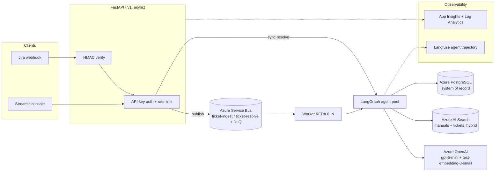
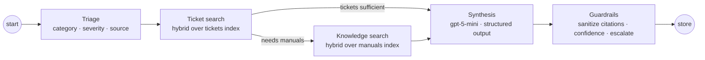

# Agentic Technical Support Copilot

**A production-grade, agentic RAG system that resolves industrial-automation support tickets with grounded, citation-backed answers — and escalates to a human when it isn't sure.**

Built on **Azure** with **LangGraph** multi-agent orchestration, **Azure AI Search** hybrid retrieval, a **CI-enforced evaluation gate**, and full **GDPR** handling. Deployed live on **Azure Container Apps**.

<p>


</p>

> **Domain:** Siemens SIMATIC S7-1500 / ET 200MP industrial automation.
> **Pattern:** the same architecture class as the *Siemens Industrial Copilot* — natural-language troubleshooting over technical manuals, built on Azure OpenAI — implemented end-to-end at portfolio scale.

---

## Table of contents

- [What it does](#what-it-does)
- [Live demo](#live-demo)
- [System architecture](#system-architecture)
- [The agent workflow](#the-agent-workflow)
- [Data flow](#data-flow)
- [Tech stack](#tech-stack)
- [Retrieval strategy](#retrieval-strategy)
- [Evaluation strategy](#evaluation-strategy)
- [Reliability & guardrails](#reliability--guardrails)
- [Security & GDPR](#security--gdpr)
- [Observability](#observability)
- [Infrastructure & DevOps](#infrastructure--devops)
- [Data model](#data-model)
- [Run it locally](#run-it-locally)
- [Run it on Azure](#run-it-on-azure)
- [Repository structure](#repository-structure)
- [Engineering standards](#engineering-standards)
- [Key architecture decisions](#key-architecture-decisions)
- [Roadmap](#roadmap)

---

## What it does

Enterprise support engineers resolve tickets by manually searching thousands of pages of manuals and years of historical tickets. This system does that automatically:

1. A support ticket arrives (live Jira webhook, or the internal console).
2. A **Triage** agent classifies category, severity, and which knowledge source to use.
3. Retrieval pulls **similar past tickets** and **relevant manual sections** via hybrid search.
4. A **Synthesis** agent drafts a step-by-step resolution, each step **cited to a specific manual page**.
5. A **Guardrails** layer verifies every citation is real, scores confidence, and **escalates to a human** when grounding or confidence is low.
6. The result — steps, citations, confidence, and per-resolution **EUR cost** — is stored and served through a versioned API and a Streamlit ops console.

**Measured quality** (11-case golden set, CI-gated): retrieval recall@k **0.94**, faithfulness **0.95**, **fabricated-citation rate 0.0**, escalation accuracy **0.91**, at **~€0.006 per resolution**.

---

## Live demo

> 🎥 **Demo video:** _add link here_
> 🌐 **Live deployment:** Azure Container Apps (Sweden Central, EU). The environment is provisioned on demand and paused to control cost — the demo video shows a full walkthrough.

The internal console: a Jira-style ticket queue with severity/status badges, live KPIs, and one-click AI resolution with clickable citations and an escalation banner.

<!-- add: docs/assets/dashboard.png -->

---

## System architecture

Two request paths share one agent core. The **synchronous** path (console/demo) runs the graph in-request; the **asynchronous** path (production) decouples ingestion and resolution through a durable queue with dead-lettering.



**Design principle — truth vs. derived data:** PostgreSQL is the durable **system of record**; Azure AI Search is **derived, rebuildable** retrieval state. The index can be reconstructed from the source manuals and the document registry at any time.

---

## The agent workflow

A typed `CopilotState` (Pydantic) flows through a **LangGraph** state machine. The knowledge-retrieval step is a **conditional edge** — skipped when triage judges historical tickets sufficient.



- **Structured outputs** — every LLM response is Pydantic-validated. Invalid output triggers one corrective re-prompt, then a **degraded, escalated** result — never a crash.
- **Versioned prompts** — prompts are YAML artifacts (`id`, `version`, `changelog`); the version is logged with every call, so any answer is traceable to the exact prompt that produced it.
- **Single LLM choke point** — every model call goes through one wrapper adding timeouts, exponential backoff + jitter retries, a per-process **circuit breaker**, a per-request **cost budget**, and **EUR cost accounting**.

---

## Data flow

**Ingestion (offline, idempotent):**
`PDF manual → page-aware chunking (SHA256 chunk IDs) → Presidio PII masking → text-embedding-3-small (1536-d) → upsert into Azure AI Search → record in Postgres document registry`

Re-ingesting is a no-op: a document content-hash short-circuits unchanged files, and deterministic chunk IDs make upserts overwrite instead of duplicate. Low-quality chunks are quarantined; a run fails if the reject rate exceeds 20%.

**Resolution (online):**
`ticket → triage → hybrid retrieval (tickets + manuals) → synthesis (cited draft) → guardrails (verify + score) → persist (Postgres) + incremental index (AI Search)`

The async worker follows a **saga**: PII-mask → commit to Postgres → embed → index. The only legal partial state is *stored-but-not-indexed* (recoverable), never *indexed-but-not-stored*.

---

## Tech stack

| Layer | Technology |
|---|---|
| **Language / runtime** | Python 3.12, async FastAPI, Pydantic v2, mypy `--strict` |
| **Agents** | LangGraph (typed state machine), structured outputs, versioned prompts |
| **LLM** | Azure OpenAI `gpt-5-mini` + `text-embedding-3-small`; provider-agnostic layer (Azure OpenAI / Azure AI Foundry / Anthropic / Ollama) |
| **Retrieval** | Azure AI Search — hybrid BM25 + vector (HNSW) + semantic ranking |
| **System of record** | Azure Database for PostgreSQL (Flexible Server); SQLAlchemy 2.0 + Alembic migrations |
| **Messaging** | Azure Service Bus (queues + native DLQ), KEDA queue-length autoscaling |
| **PII / privacy** | Microsoft Presidio (spaCy `en_core_web_md`) |
| **Evaluation** | Golden dataset, deterministic retrieval metrics, LLM-as-judge, MLflow tracking, CI eval gate |
| **Observability** | Langfuse (EU) agent tracing, Application Insights + Log Analytics, structured JSON logs w/ correlation IDs |
| **Infrastructure** | Terraform (`azurerm`), Azure Container Apps, ACR, Key Vault, user-assigned Managed Identity |
| **CI/CD** | GitHub Actions (CI, eval gate, OIDC deploy), `production` environment, revision rollback |
| **Packaging** | Multi-stage Dockerfile (api / worker / ingest / ui), non-root; `docker compose` local stack |
| **UI** | Streamlit internal support console |

---

## Retrieval strategy

Retrieval quality is the core of the product, so it uses **one managed service instead of hand-rolled components**.

- **Hybrid search:** every query runs **BM25 keyword** + **vector KNN (HNSW)** in a single request, fused server-side with **Reciprocal Rank Fusion**, then **semantic re-ranking**. Keyword search nails exact tokens (error codes like `0x2521`, part numbers); vectors catch paraphrases ("CPU won't start" ≈ "startup inhibit").
- **Two indexes:** `manuals` (chunk-level, page citations) and `tickets` (with resolution text). Triage labels become **server-side filters**.
- **Typed results:** retrieval returns typed hits carrying `(doc, page)` citation metadata — which the guardrails layer later validates against, making "fabricated-citation rate = 0" a *testable invariant*.

**Migration note (honest):** this replaced a v1 FAISS + BM25 prototype. An evaluation comparison surfaced a **circular-evaluation trap** in the original benchmark (its ground-truth labels were derived from the old system's own outputs); the fix was an independently curated golden set. Recognizing and correcting that bias is documented in [`eval/results/`](eval/results/).

---

## Evaluation strategy

Quality is **measured, not asserted** — and regressions are blocked in CI. Every prompt/agent/retrieval change re-runs the golden dataset; a metric below its floor fails the build.

| Metric | What it verifies | Result | Gate floor |
|---|---|---:|---:|
| **retrieval recall@k** | Did we find the pages that actually answer the ticket? | **0.94** | 0.60 |
| retrieval precision@k | How much retrieved context was relevant? | 0.55 | 0.30 |
| **fabricated-citation rate** | Every citation points to a really-retrieved page | **0.00** | 0.0 max |
| **faithfulness** (LLM judge) | Every claim is supported by the retrieved context | **0.95** | 0.70 |
| answer relevancy (LLM judge) | The answer addresses the ticket | 0.95 | 0.70 |
| **escalation accuracy** | Escalates exactly the tickets the manual can't answer | **0.91** | 0.80 |
| mean confidence (covered) | Calibration on answerable tickets | 0.89 | 0.60 |

- **Ground truth judged from the manual**, never from the system's outputs (avoids circular evaluation).
- **Two scoring families:** deterministic metrics (retrieval precision/recall with page tolerance, fabricated-citation rate, escalation correctness) + an **LLM-as-judge** for faithfulness and answer relevancy, reusing the cost-tracked LLM wrapper.
- **Experiment tracking in MLflow**; per-trace online scores in Langfuse — clear separation of offline vs. online.
- **The gate earned its keep:** on its first run it *disproved* a suspected confidence bug (the numbers were healthy) **and** caught a real one — the model occasionally cited a manual's internal cross-reference page instead of the chunk's own page. Fixed by making guardrails **sanitize** ungrounded citations, driving fabrication to 0 *by construction*.

Run it: `make eval` (full) or `make eval-fast` (deterministic only).

---

## Reliability & guardrails

Every failure is **retried, degraded, escalated, or dead-lettered — never silently swallowed.**

- **Typed exception taxonomy** → each maps to one RFC 7807 `problem+json` response with a correlation ID; clients never see a stack trace.
- **Transient faults:** backoff+jitter retries + per-dependency circuit breaker (open → 503 + `Retry-After`).
- **Bad LLM output:** one corrective re-prompt, then a degraded escalation.
- **Poison messages:** Service Bus redelivery → **dead-letter after 5 attempts** (verified with a poison-message drill).
- **Grounding:** guardrails drop any citation not in the retrieved context, so the delivered answer's fabricated-citation rate is **0 by construction**.
- **Every failure path has an explicit test** (429 storms, poison messages, malformed generations, mid-saga faults).

---

## Security & GDPR

Built for the EU / German market — data residency and erasure are first-class.

- **Managed Identity everywhere** — the apps authenticate to ACR, Key Vault, Service Bus, and Storage passwordlessly; **zero secrets in code or images**. Local dev uses `DefaultAzureCredential`.
- **Secrets in Key Vault**, read by reference through the managed identity; deployer and app get least-privilege roles.
- **API security:** hashed API keys (SHA-256 + pepper, never plaintext), per-key rate limiting, HMAC-verified webhooks (constant-time compare), security headers, request-size limits.
- **PII masking (Presidio)** before any storage, indexing, or logging — a vector is an irreversible projection of its text, so masking runs at the pipeline entrance.
- **GDPR right-to-be-forgotten:** `DELETE /v1/tickets/{id}` runs a **verified deletion saga** across Azure AI Search + PostgreSQL, scrubs job payloads, and writes an audit-log entry. Verified live: create → masked store → erase → `404`.
- **EU data residency:** all resources in Sweden Central; Langfuse EU region. Full data-flow map in [`docs/COMPLIANCE.md`](docs/COMPLIANCE.md).

---

## Observability

Three concerns, three tools, one correlation ID that ties a request together.

| Question | Tool |
|---|---|
| Why did the agent produce *this* answer, at what cost? | **Langfuse** (agent trajectory, EU) |
| Is the service up / fast / erroring? What happened in this request? | **Application Insights + Log Analytics** (auto from Container Apps + structured JSON logs) |

The OpenTelemetry-version tradeoff (Langfuse vs. Azure Monitor exporter) and the deliberate decision *not* to self-host a Prometheus/Grafana stack are documented in [`docs/OBSERVABILITY.md`](docs/OBSERVABILITY.md).

---

## Infrastructure & DevOps

- **Terraform (`azurerm`)** provisions the whole platform — resource group, ACR, Key Vault, Managed Identity + RBAC, PostgreSQL, AI Search, Service Bus, Container Apps environment, Log Analytics + App Insights. `plan → apply → destroy → apply` reproduces cleanly; teardown is the cost-control strategy.
- **Azure Container Apps** (not AKS — an explicit ADR): KEDA autoscaling (worker **0→N** on queue length, API on HTTP concurrency), revisions with traffic split for safe rollout/rollback, Managed Identity, ingress + TLS.
- **CI/CD (GitHub Actions):**
  - `ci.yml` — ruff, mypy strict, pytest, Docker builds (api/worker/ui), Terraform fmt + validate.
  - `eval.yml` — the golden-dataset eval gate on PRs touching prompts/agents/retrieval.
  - `cd.yml` — on merge to main: build+push images by SHA → roll each app → smoke test → **roll back on failure**, authenticated by **OIDC** (no stored cloud secret) and gated by a GitHub **production environment**.
- **Cost-engineered:** ~€19/mo running, torn down or paused when idle. Real numbers in [`docs/COST.md`](docs/COST.md).

---

## Data model

PostgreSQL (Alembic-managed), indexed query paths, no pickle anywhere:

`tickets` · `resolutions` (structured output, citations JSONB, confidence, `cost_eur`, App Insights + Langfuse trace IDs) · `jobs` · `document_registry` · `processed_messages` (consumer idempotency) · `audit_log` · `api_keys` (hashed).

Foreign keys encode GDPR semantics: resolutions **cascade** with their ticket (personal data); jobs **set null** (operational history is not personal data).

---

## Run it locally

**Prerequisites:** Docker, Python 3.12, Azure CLI (`az login`), an Azure OpenAI resource with `gpt-5-mini` + `text-embedding-3-small` deployments, and an Azure AI Search service (Free tier). Full details in [`docs/RUNBOOK.md`](docs/RUNBOOK.md).

```bash
# 1. setup
python3.12 -m venv .venv && source .venv/bin/activate
make install                      # deps + spaCy en_core_web_md
cp .env.example .env              # fill in Azure OpenAI + AI Search endpoint/keys
make check-azure                  # verify the model connection

# 2. one-time knowledge base (indexes + ingest the manual, ~€0.005)
make search-indexes
docker compose up -d db
make ingest

# 3. run the full stack (Postgres + migrations + API + UI)
make up
curl -s -X POST localhost:8000/v1/tickets/seed -H "X-API-Key: <your API_KEY>"
open http://localhost:8501        # the console

# quality + tests
make lint      # ruff + mypy strict
make test      # 82 tests
make eval      # the golden-dataset eval gate
```

Try a resolution from the terminal:

```bash
make resolve title="CPU STOP after firmware update" \
             desc="After updating firmware the CPU enters STOP with the SF LED on"
```

---

## Run it on Azure

Full walkthrough in [`docs/DEPLOY.md`](docs/DEPLOY.md); one-time OIDC setup in [`docs/CICD.md`](docs/CICD.md).

```bash
# 1. provision the platform (~8 min; review the plan + cost first)
cd infra
export TF_VAR_subscription_id=$(az account show --query id -o tsv)
export TF_VAR_postgres_admin_password='<a-strong-password>'
terraform init && terraform apply

# 2. build & push the three images to ACR
az acr build -r <acr> -t copilot-api:latest    -f docker/Dockerfile --target api    .
az acr build -r <acr> -t copilot-worker:latest -f docker/Dockerfile --target worker .
az acr build -r <acr> -t copilot-ui:latest     -f docker/Dockerfile --target ui     .

# 3. secrets to Key Vault, then create the apps
#    (az keyvault secret set ...; see docs/DEPLOY.md)
export TF_VAR_azure_openai_endpoint='https://<your-openai>.cognitiveservices.azure.com'
terraform apply -var deploy_apps=true

# 4. migrate the cloud DB, then read the public URLs
az containerapp job start --name copilot-dev-migrate --resource-group copilot-dev-rg
terraform output api_url
terraform output ui_url

# teardown (stops the meter)
make infra-down
```

After merge to main, `cd.yml` performs this deploy automatically via OIDC.

---

## Repository structure

```
src/copilot/
├── api/          FastAPI app, routers, middleware, RFC 7807 handlers
├── agents/       LangGraph graph, nodes, typed CopilotState
├── ingestion/    chunking · Presidio masking · embedding · index upsert · pipeline
├── retrieval/    AI Search hybrid client + index definitions
├── llm/          provider-agnostic layer + the wrapper (retries, breaker, budget, cost)
├── messaging/    Service Bus publisher/consumer, idempotency
├── security/     hashed API keys, rate limiting, HMAC
├── evaluation/   golden dataset runner, metrics, LLM judge, MLflow
├── telemetry/    Langfuse integration
├── db/           SQLAlchemy models, Alembic migrations
├── gdpr.py       right-to-be-forgotten deletion saga
└── worker.py     async Service Bus worker
ui/               Streamlit console
prompts/          versioned prompt artifacts (YAML front-matter)
eval/             golden dataset, thresholds, recorded results
infra/            Terraform (platform + container apps)
docker/           multi-stage Dockerfile (4 targets)
.github/workflows ci.yml · eval.yml · cd.yml
docs/             ADRs, COMPLIANCE, RUNBOOK, DEPLOY, COST, OBSERVABILITY
tests/            unit + failure-path + API tests (82)
```

---

## Engineering standards

- **`mypy --strict`** across the v2 surface; **ruff** lint; **82 tests** including explicit failure-path tests.
- **Exact dependency pinning** (application, not library) for reproducible builds across dev / CI / container.
- **PR workflow with a CI eval gate**; prompts change only via PR.
- **Conventional commits**; ADRs for every significant decision.

---

## Key architecture decisions

Each is documented as an ADR:

- **Azure Container Apps, not AKS** — serverless K8s substrate with KEDA + revisions; a cluster is pure overhead at this scale.
- **Terraform, not Bicep** — plan-before-apply, cross-cloud transferability.
- **Azure AI Search, not FAISS+BM25 or pgvector** — one managed service for hybrid + semantic ranking, the retrieval-quality core.
- **Service Bus, not Kafka** — queue semantics + native DLQ are the exact fit; Kafka would be over-engineering here.
- **Langfuse, not LangSmith** — MIT-licensed, EU data region, native LangGraph integration.
- **App Insights, not self-hosted Prometheus/Grafana** — Azure already renders the metrics; a second stack is unjustified operational overhead.
- **Batch "cold path" (ADF + ADLS) designed but deliberately not built** — for an AI-engineering scope, the hot path + reconciliation story is documented; the batch tier is the scale-up path.

---

## Roadmap

- **Jira MCP server** — expose ticket operations as Model Context Protocol tools so any MCP-capable client can reuse the integration.
- **Entra ID / OAuth2** auth to replace API keys for multi-tenant use.
- **Batch cold path** (Azure Data Factory + ADLS Gen2) for nightly bulk sync and reconciliation.
- **Prompt management** in Langfuse for team-scale prompt iteration.

---

## License

MIT — see [LICENSE](LICENSE).
